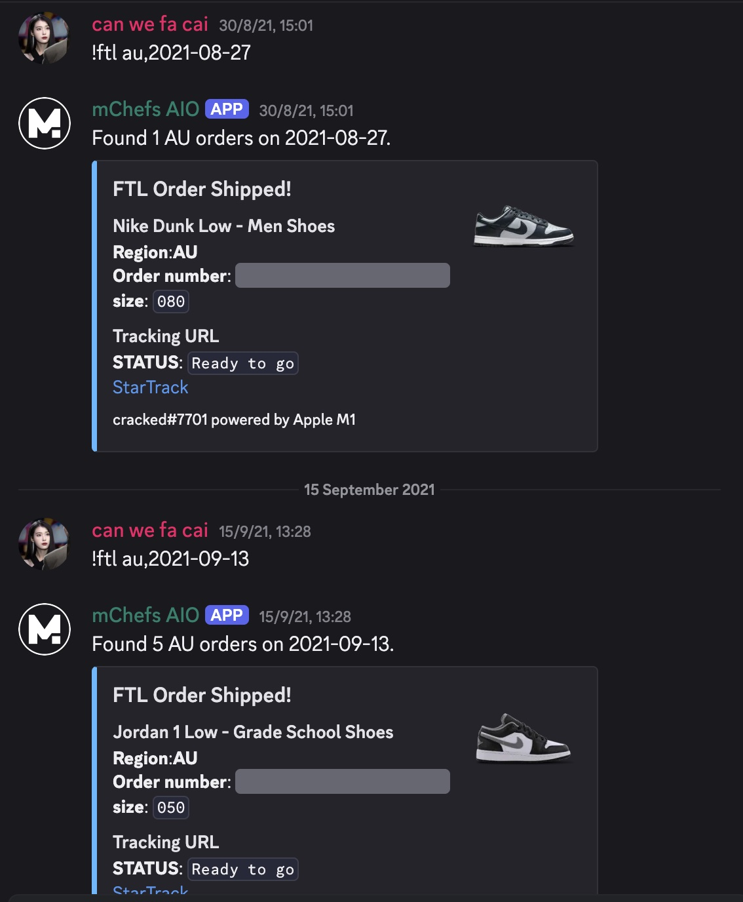
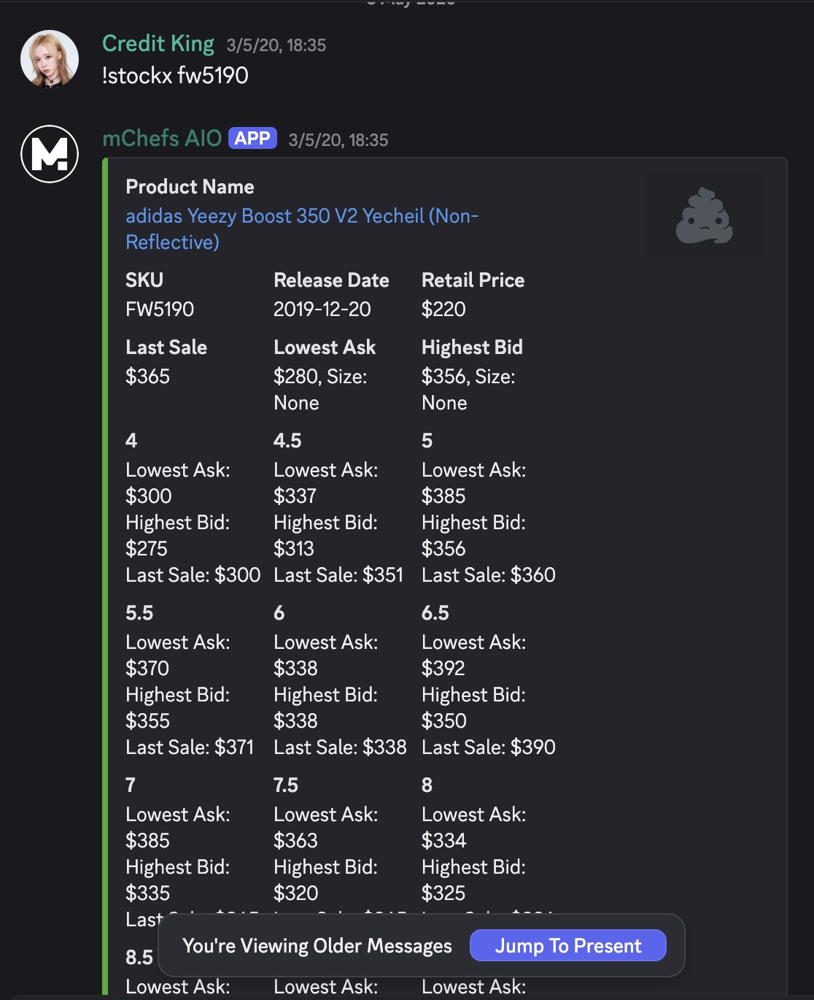
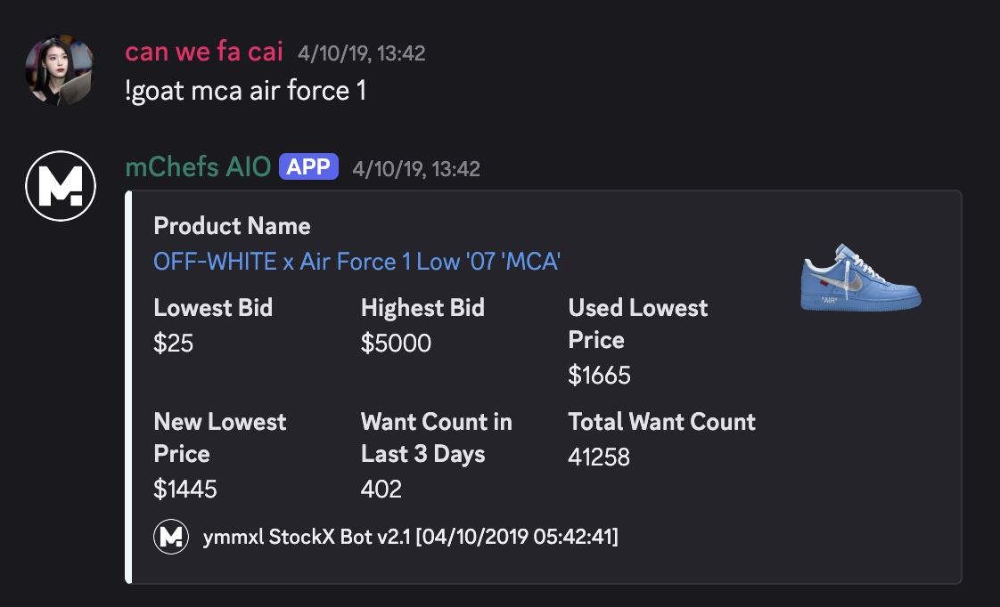
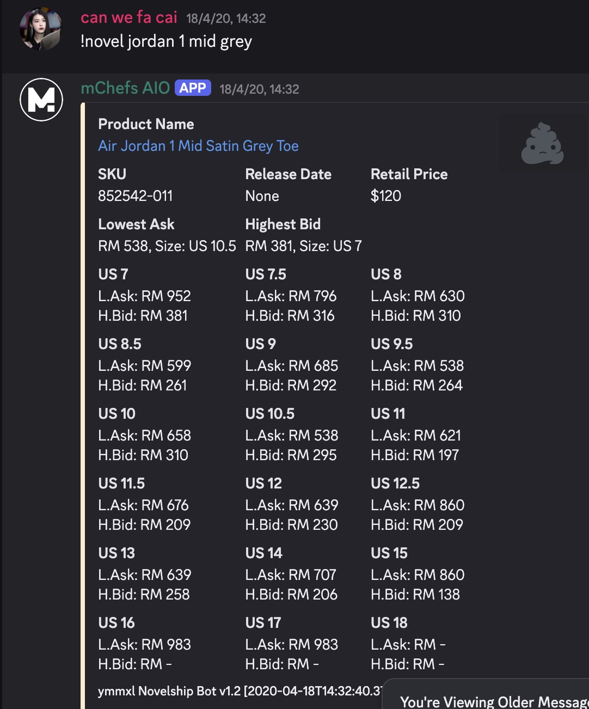
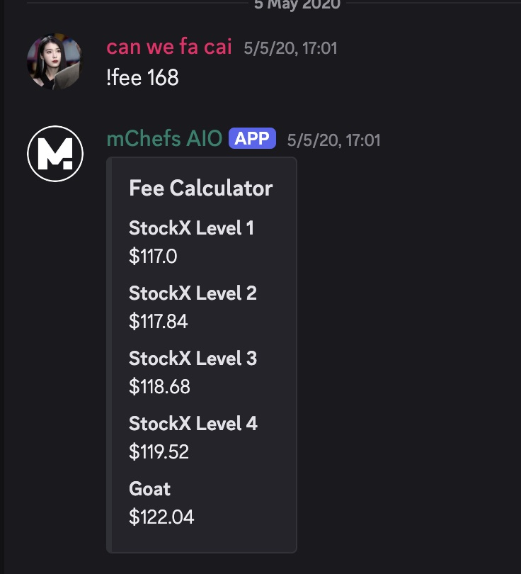
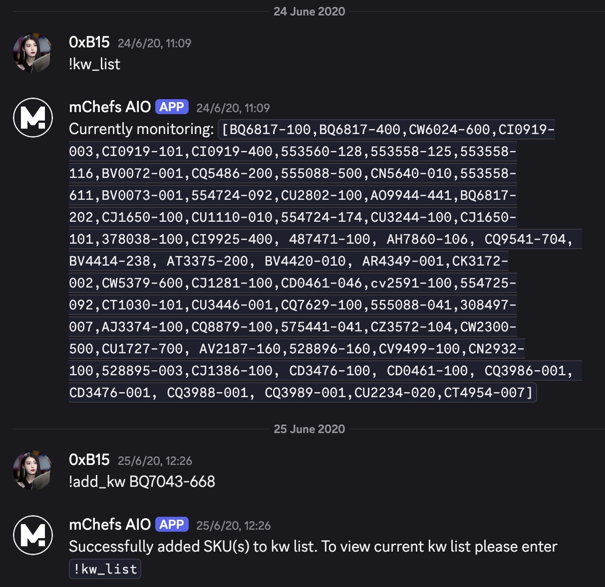
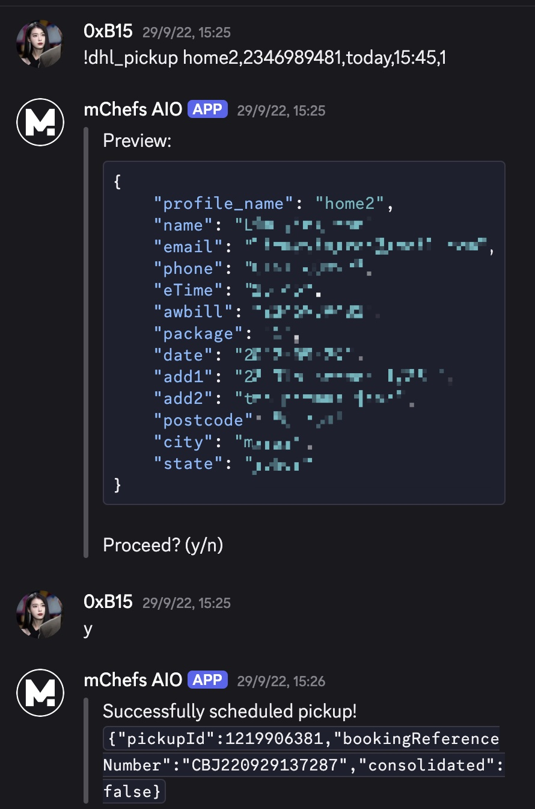
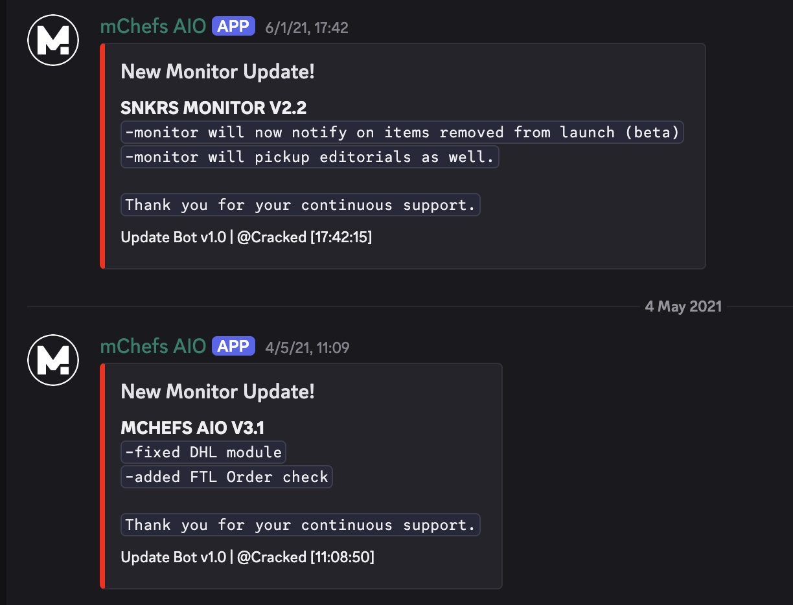

# MChefs-AIO

[Archived]

My beloved Discord bot for sneaker reselling. A versatile all-in-one utility to make our lives easier.
Built with Discord.py and PostgreSQL; Running on heroku. Nothing fancy.

## Features
#### FTL Order Tracker
- Check shipping status for Footlocker orders and automatically returns the shipping tracking link.
- Finds orders from the #checkout channel and checks for its status.
 
#### StockX Bot
- Fetch real-time data with lowest asks, highest bids and size-specific pricing breakdown
 
#### GOAT Bot
- Get market data including prices, bids, and want counts
 
#### NovelShip Bot
- Check prices on NovelShip (mainly for Singapore market)
 
#### Fee Calculator 
- Calculate final payout for different StockX seller levels and GOAT
 
#### Keyword Management
- Add/remove/list SKUs for our in-built monitors automatically
 
#### DHL Pickup Scheduler
- Save shipping profiles and schedule pickups easily
 
#### Monitor Updates
- Broadcast changes to monitors
 

## Note

If you see cringe code, I'll laugh with you :) 
